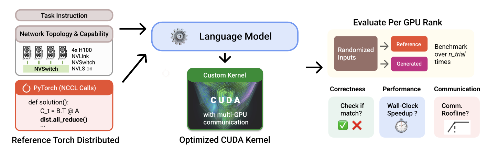

# ParallelKernelBench: Can LLMs write fast multi-GPU kernels?


ParallelKernelBench (PKB) is a benchmark with the goal of enabling LLMs to optimize multi-GPU kernels. Specifically, we investigate model capabilities on turning existing PyTorch + NCCL reference code into fine-grained CUDA (or related DSLs).

The design is heavily inspired by [KernelBench](https://github.com/ScalingIntelligence/KernelBench).

<p align="center">
  📄 <a href="https://www.alphaxiv.org/abs/2606.parallel-kernel-bench"><b>Paper</b></a> &nbsp;·&nbsp;
  🤗 <a href="https://huggingface.co/datasets/togethercomputer/ParallelKernelBench_Problems"><b>Hugging Face</b></a> &nbsp;·&nbsp;
  🌐 <a href="http://www.together.ai/blog/parallelkernelbench"><b>Blog</b></a>
</p>

---

## 👋 Overview



PKB asks models to **optimize** multi-GPU kernels: each problem has a PyTorch + NCCL reference under `reference/`; candidates go in `solutions_<backend>/` (CUDA, Triton, ParallelKittens, or run-specific trees from generation).

**Correctness:** `eval` mode runs reference and candidate on the same inputs and compares per-rank outputs (`rank_*.pt`) within `--atol` / `--rtol`.

**Performance:** optional timing reports speedup vs reference. We follow [ThunderKittens 2 — benchmark rigor](https://hazyresearch.stanford.edu/blog/2026-02-19-tk-2): 500 warmup iterations, 100 timed iterations (see worker / perf utilities).

**Roofline (approximate):** `reference_rooflines_code/` provides utilization estimates; contributions welcome.

---

## ⚙️ Setup

PKB uses **[uv](https://docs.astral.sh/uv/)** for reproducible Python environments.

### Prerequisites

- **OS:** Linux with NVIDIA GPUs (multi-GPU runs need matching `torchrun` / NCCL).
- **Driver:** Recent enough for CUDA 12.8 wheels (H100 nodes typically satisfy this).
- **ParallelKittens backend (optional):** clone [ThunderKittens](https://github.com/HazyResearch/ThunderKittens) and set `THUNDERKITTENS_ROOT` to the repo root (Modal/Together images do this automatically).

### Install with uv

```bash
# Install uv (skip if already installed)
curl -LsSf https://astral.sh/uv/install.sh | sh

cd ParallelKernelBench

cd kernelgen
git clone https://github.com/SWE-agent/mini-swe-agent.git
cd ..

uv sync

# Verify the environment
uv run python -c "import torch; print(torch.__version__, torch.cuda.is_available())"
```

This creates `.venv/` at the repo root and installs all dependencies from the pinned `uv.lock` (commit that file when you change `pyproject.toml`).

### API keys (generation / cloud eval)

- Google models: `GEMINI_API_KEY` or `GOOGLE_API_KEY`.
- Together models: `TOGETHER_API_KEY` (see `ALLOWED_MODELS` in `kernelgen/generate_kernel.py`).
- Anthropic models: `ANTHROPIC_API_KEY`.
- OpenAI models: `OPENAI_API_KEY`.

---

## 🚀 Usage

### Generate a single solution

`[kernelgen/generate_kernel.py](kernelgen/generate_kernel.py)` assembles a kernel-generation prompt from `[kernelgen/prompts.toml](kernelgen/prompts.toml)` and optionally calls an LLM. You can (1) print the prompt only (`--print-prompt`) or (2) generate a solution file for one problem and backend.

```bash
# [print-prompt] Inspect the assembled user prompt; no API call, no file written
#   --precision: fp32 | fp16 | bf16 (must match an entry in prompts.toml)
#   --hardware: h100_8 | b200_72 (optional; omitted → "none" in the output directory name)
#   --backend: cuda | triton | parallelkittens (must match [backends] in prompts.toml)
#   --model: must be in ALLOWED_MODELS in generate_kernel.py (ignored with --print-prompt)
uv run python kernelgen/generate_kernel.py \
  --precision bf16 \
  --hardware h100_8 \
  --problem 1 \
  --model zai-org/GLM-5.1 \
  --backend cuda \
  --print-prompt

# [generate] Call the LLM and write e.g. solutions_cuda_bf16_h100_8_together_zai-org_GLM-5.1/1_allreduce_cuda.py
uv run python kernelgen/generate_kernel.py \
  --precision bf16 \
  --hardware h100_8 \
  --problem 1 \
  --model zai-org/GLM-5.1 \
  --backend cuda

# Other backends (same flags; different output dir prefix and filename suffix)
uv run python kernelgen/generate_kernel.py --precision bf16 --hardware h100_8 --problem 1 --model gemini-3-pro-preview --backend triton

uv run python kernelgen/generate_kernel.py --precision bf16 --hardware h100_8 --problem 1 --model gemini-3-pro-preview --backend parallelkittens

# Optional: custom prompt template
uv run python kernelgen/generate_kernel.py --paths-to-prompts-template /path/to/prompts.toml --precision bf16 --problem 1 --backend cuda --print-prompt
```

**Outputs:** without `--print-prompt`, each run writes under `solutions_<backend>_<precision>_<hardware|none>_<provider>_<model_slug>/` as `{stem}_{backend}.py` (for example `1_allreduce_cuda.py`). Pass that directory to `[run_local.py](run_local.py)` via `--solutions-dir` when evaluating.

### Generate a single solution (mini-SWE-agent)

We provide a script (`[kernelgen/generate_kernel_agent.py](kernelgen/generate_kernel_agent.py)`) that uses mini-swe-agent in generating a kernel. Note that we verified functionality on Google models.

To use this script, you must install mini-swe-agent separately:

```bash
pip install -e kernelgen/mini-swe-agent
cd kernelgen
git clone https://github.com/SWE-agent/mini-swe-agent.git
```

An example command:

```bash
python kernelgen/generate_kernel_agent.py \
  --problem 1 \
  --backend cuda \
  --model gemini-3-flash-preview \
  --step-limit 3 \
  --timeout 600 \
  --remote-dryrun-command \
    'python run_local.py --nproc-per-node 4 --mode dryrun --problem {problem_arg} --solution {backend} --measure-perf' \
  --remote-eval-command \
    'python run_local.py --nproc-per-node 4 --mode eval --problem {problem_arg} --solution {backend} --measure-perf'
```

### Generate multiple or all solutions

We provide convienient functionality to the `--problem` flag to make it simple to generate for multiple problems:

```bash
# generate every problem under reference/
python kernelgen/generate_kernel.py \
  --precision bf16 \
  --hardware h100_8 \
  --problem all \
  --model deepseek-ai/DeepSeek-V4-Pro \
  --backend cuda

# generate a specific subset of problems
python kernelgen/generate_kernel.py \
  --precision bf16 \
  --hardware h100_8 \
  --problem '[72, 73, 74, 75, 76, 77, 78, 79, 80, 81, 82, 83, 84, 85, 86, 87, 88]' \
  --model zai-org/GLM-5.1 \
  --backend cuda
```

### Evaluate a single problem (locally)

`[run_local.py](run_local.py)` is the local multi-GPU harness (via `torchrun`). Assuming you have an environment with multiple GPUs connected via NVLink, you can (1) run one backend in isolation (`dryrun`) or (2) compare a candidate kernel against the reference (`eval`).

```bash
# [dryrun] Launches a single torchrun job for --solution. Does not compare to reference. Use this to verify a kernel compiles, runs, and produces rank outputs.

# Reference PyTorch + NCCL baseline (default solutions dir: reference/)
uv run python run_local.py \
  --nproc-per-node 4 \
  --mode dryrun \
  --problem 1 \
  --dtype bfloat16 \
  --solution reference \   # (reference / cuda / triton / parallelkittens)
  --download \             # Optional: save rank_*.pt under logs/problem_<stem>/<solution>/
  --measure-perf           # Optional: warmup + timed iterations; prints and saves rank_*_perf.json summary

# CUDA solution (in a custom directory)
uv run python run_local.py \
  --nproc-per-node 4 \
  --mode dryrun \
  --problem 1 \
  --dtype bfloat16 \
  --solution cuda \
  --solutions-dir /path/to/custom/cuda/solution \
  --download \
  --measure-perf \
  --profile                # Optional: save PyTorch profiler traces (written under traces/)

# [eval] For each of --trials random inputs (default 5), runs reference then --solution.
#   Compares rank_*.pt tensors, and stops on first mismatch. --solution must NOT be reference.

python run_local.py \
  --nproc-per-node 4 \     # number of GPUs to evaluate on
  --mode eval \
  --problem 1 \
  --dtype bfloat16 \
  --solution cuda \
  --solutions-dir /path/to/custom/cuda/solution \
  --trials 5 \             # number of RNG trials (default 5)
  --atol 1e-5 \            # tensor compare tolerances (default 1e-5 each)
  --rtol 1e-5 \
  --download \             # keep per-trial artifacts under logs/
  --measure-perf           # time reference and solution
```

**Artifacts:** with `--download`, outputs land in `logs/problem_<stem>/{reference|cuda|triton|...}/` (per-rank `.pt` files, optional `rank_*_perf.json`). Inspect them offline with `[utils/compare_outputs.py](utils/compare_outputs.py)` and `[utils/compare_performance.py](utils/compare_performance.py)` (see [Inspect downloaded outputs](#inspect-downloaded-outputs)).

### Evaluate a single problem (Together Containers)

Unfortunately, not everyone can buy a DGX 8xH100 compute node at their local Costco. So we provide the ability to evaluate using Together AI's cloud container service (Together Containters). Dedicated GPU jobs use the Together **Jig** flow (`together beta jig`).

```bash
# find your together API key from your profile/dashboard
export TOGETHER_API_KEY="..."

# creates a dockerfile, then build, push, deploy to the cloud
together beta jig deploy

# once the image is uploaded ot the cloud server, you can evaluate just like run_local.py
# e.g.
python run_together.py --mode dryrun --problem 1
python run_together.py --mode dryrun --problem 1 --solution cuda --download
python run_together.py --mode dryrun --problem 1 --solution cuda --download --measure-perf --profile

python run_together.py --mode eval --problem 1
python run_together.py --mode eval --problem 1 --solution cuda --download
python run_together.py --mode eval --problem 1 --solution cuda --download --measure-perf --profile

# monitor cloud status
together beta jig status
# view cloud machine logs
together beta jig logs --follow
# save resources
together beta jig destroy
```

You can also reuse a tagged image without a full rebuild:

```bash
together beta jig build --tag pkb_no_nvshmem
together beta jig push --tag pkb_no_nvshmem
together beta jig deploy --image registry.together.xyz/<your-registry-path>:pkb_no_nvshmem
```

### Inspect downloaded outputs

After `run_local.py --download` (and optionally `--measure-perf`), artifacts are organized as:

```text
logs/problem_<stem>/
  reference/          # rank_0.pt, rank_1.pt, … and optional rank_*_perf.json
  cuda/               # same layout for the candidate backend
  comparison_cuda.json   # written by compare_performance.py
```

`--problem` accepts the same ids as `run_local.py` (e.g. `1` resolves to `1_allreduce` → `logs/problem_1_allreduce/`).

```bash
# Compare reference vs CUDA tensors (default --solution cuda)
uv run python utils/compare_outputs.py --problem 1

# Compare against another backend; tighten tolerances if needed
uv run python utils/compare_outputs.py --problem 1_allreduce --solution triton --atol 1e-3 --rtol 1e-3

# Inspect one backend folder without comparing (print shapes / sample values per rank)
uv run python utils/compare_outputs.py --problem 1 --inspect reference
uv run python utils/compare_outputs.py -p 1 -i cuda

# Compare wall-clock perf from rank_*_perf.json (requires --measure-perf on both runs)
uv run python utils/compare_performance.py --problem 1
uv run python utils/compare_performance.py --problem 1 --solution cuda

# Custom logs root (default: <repo>/logs)
uv run python utils/compare_outputs.py --problem 1 --logs-dir /path/to/logs
```

---

## Future Directions

This started as an internship project: we would greatly welcome contributions!

- Internode-specific problems (e.g. prefill-decode disaggregation)
- Internode support (NCCL GIN, NVSHMEM)
- More backends for modern DSLs (e.g. CuTe)


### Adding a backend

1. Add `init_<backend>` / `finalize_<backend>` in `utils/init_and_finalize_backends.py` and wire them in `scripts/worker.py` inside `run_worker()`.
2. Modify the prompt template in `kernelgen` and add at least one sample solution if applicable.
3. The current infra assumes we have a single `.py` file per solution.


### Adding a problem

1. Fix tensor shapes and allocation in `utils/input_output_tensors.py` (shared across backends).
2. Define performance rules in `utils/performance.py` if needed.
3. Add the reference under `reference/` and optional solutions under the appropriate `solutions_`* tree.

---

## 📚 Citation

If you use ParallelKernelBench in your work, please cite:

```bibtex
@misc{chan2026parallelkernelbench,
      title={ParallelKernelBench: Can LLMs Write Fast Multi-GPU Kernels?},
      author={Willy Chan and Nathan Paek and Simon Guo and Simran Arora and Daniel Fu},
      year={2026},
      howpublished={\url{https://github.com/Willy-Chan/ParallelKernelBench}},
      note={Benchmark and evaluation harness for multi-GPU kernel generation.},
}
```

Special thanks to Stuart Sul, William Hu, Austin Silveria, Hayden Prairie, Jonah Yi for their invaluable assistance and feedback! And of course, thank you to Together AI for sponsoring the compute for this project.
